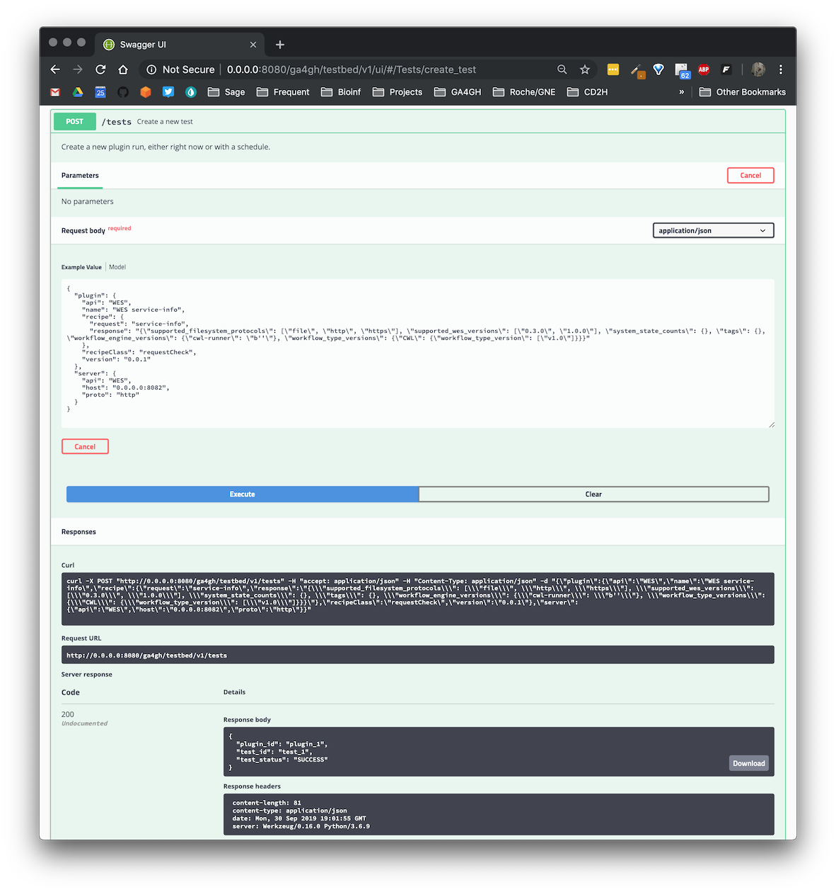

# Authoring test plugins

A plugin defines the logic of a "test", where each test consists of running one or more plugins on one or more servers.

The current structure of a plugin, as defined in the OpenAPI spec, is as follows:

```yaml
Plugin:
    title: Plugin
    type: object
    properties:
    id:
        $ref: '#/components/schemas/PluginID'
    name:
        type: string
    version:
        type: string
    api:
        type: string
        enum:
        - WES
        - TRS
    recipeClass:
        type: string
        enum:
        - requestCheck
    recipe:
        type: object
```

## Plugin classes

Not yet implemented, but we might want to distinguish different "classes" of plugins based on their complexity — e.g.,

+ Compliance — simple checks of whether an API implementation conforms to spec
+ Unit — slightly more targeted tests to assess the accuracy of responses for a single API servers
+ Integration — tests that may involve multiple requests, responses, and interchange between multiple servers (potentially of different API types)

## Recipe classes

A recipe is the internal algorithm executed by a plugin. The recipe is defined separately so that the appropriate Python classes and module can be used to construct the plugin, while ultimately providing a standard interface for the plugin itself.

Recipe classes indicate _how_ a test plugin will be performed as well as how the plugin should be specified. For example:

+ A direct test of an API request (e.g., URI) to verify whether the response JSON matches the expected result.
+ Execution of multiple requests and formatting/evaluation of results as part of a script.
+ Use of internal Python objects to communicate with APIs, format requests, translate results, and perform more complex evaluations.

### `requestCheck`

The simplest (and only) plugin currently supported by the Testbed is a "request check". For this type of plugin, the author provides a request path or route and the expected response JSON. **Note:** information about the API being tested, including the base URL for the server, is specified at the level of the plugin object.

```yaml
RequestRecipe:
    title: RequestRecipe
    type: object
    properties:
    request:
        type: string
    response:
        type: string
```

#### Defining the test

Below is an example plugin that does a `GET` request for the `service-info` endpoint of a WES server.

```json
{
    "api": "WES",
    "name": "WES service-info",
    "recipe": {
        "request": "service-info",
        "response": "{\"supported_filesystem_protocols\": [\"file\", \"http\", \"https\"], \"supported_wes_versions\": [\"0.3.0\", \"1.0.0\"], \"system_state_counts\": {}, \"tags\": {}, \"workflow_engine_versions\": {\"cwl-runner\": \"b''\"}, \"workflow_type_versions\": {\"CWL\": {\"workflow_type_version\": [\"v1.0\"]}}}"
    },
    "recipeClass": "requestCheck",
"version": "0.0.1"
}
```

For this recipe, the `request` is just a string representing the endpoint: `"service-info"`, and the `response` is the escaped JSON response.


#### Running the test

The full request body for the `POST /tests` to create and run the test looks like this (this example is included in the OpenAPI spec, so should be available when you run the Swagger UI):

```json
{
  "plugin": {
    "api": "WES",
    "name": "WES service-info",
    "recipe": {
      "request": "service-info",
      "response": "{\"supported_filesystem_protocols\": [\"file\", \"http\", \"https\"], \"supported_wes_versions\": [\"0.3.0\", \"1.0.0\"], \"system_state_counts\": {}, \"tags\": {}, \"workflow_engine_versions\": {\"cwl-runner\": \"b''\"}, \"workflow_type_versions\": {\"CWL\": {\"workflow_type_version\": [\"v1.0\"]}}}"
    },
    "recipeClass": "requestCheck",
    "version": "0.0.1"
  },
  "server": {
    "api": "WES",
    "host": "0.0.0.0:8082",
    "proto": "http"
  }
}
```

> For this particular test to work, you'll need a local instance of a WES service running. You can do this by installing the `wes-service` package and running the built-in `wes-server`:

```
pip install wes-service
wes-server --port 8082
```

The response (if the test runs successfully) should look like this:

```json
{
  "plugin_id": "plugin_1",
  "test_status": "SUCCESS",
  "test_id": "test_1"
}
```

The creation of a new plugin and test should trigger the registration of those objects and events in a database, with unique IDs assigned accordingly. The current response uses placeholder values for `plugin_id` and `test_id` until we add backend infrastructure and settle on a response format.

Here is a screenshot of the test creation in the Swagger UI:


_More types of plugins coming soon!_
